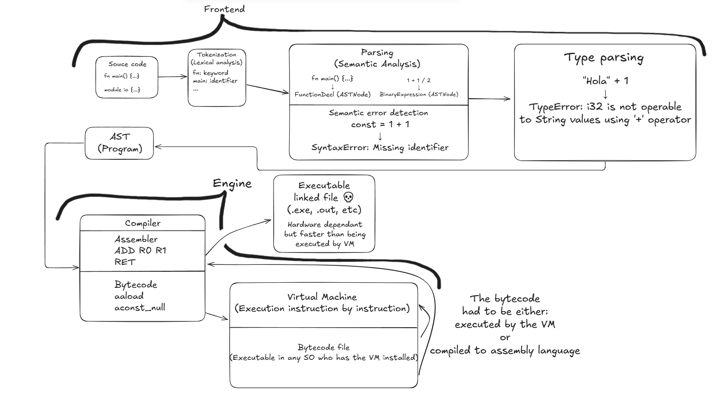

# Scraplang

## :information_source: Warnings and Philosophy

ScrapLang was originally born as a joke within a friend group, but for me, _Raxabi_, as the only active developer of the project at the moment, I saw this as a chance to learn something new and explore a programming area that had intrigued me for some time.

With that in mind, although I decided to push the project beyond a joke, it may still be considered a joke in some aspects and might never be released.

I’ve been a programmer since 2021 — quite a short time, really, but enough to know what types of programming (paradigms, styles, etc.) I consider better. I want to express those preferences in a new programming language that maybe doesn’t bring anything revolutionary to the industry, but gives the user a pleasant, familiar, and easy development experience, as well as document the creation process for other programmers interested in compiler and interpreter development.

## :warning: Considerations

- As you readed above, this project is experimental and still in a inmmature stage for the commercial use
- A more detailed README will be finished when somehow the source code can be runned
- At the moment, this README will only contain some warnings about the project and some experimental, provisional uses
- At the moment, this project is obviously incompleted, and still is a experimental not responsible project

## :gear: Language layers

The following image shows a provisional architecture of the project of how the source code is treated until it's executed



## :computer: ScrapLang CLI

### :arrow_forward: Running the program

#### Run the program from the source code

```bash
scrap run main.scrap
```

#### Run a portable from a bytecode file

```bash
scrap run main.byte
```

> For more info about what it's a '.byte' file, reads: [Compile to portable bytecode](#compile-to-portable-bytecode)

### :package: Compiling the program

#### Compile to portable bytecode

```bash
scrap build --type byte main.scrap
```

#### Compile to assembly code

```bash
scrap build --type asm main.scrap
```

#### Compile to hardware dependant machine code

```bash
scrap build --type bin main.scrap
```

### Specify a name to the output file

```bash
scrap build --type ... --output myfile main.scrap
```

### Compiling from different files

Since ScrapLang is capable to compile to assembly language directly from the generated AST and from generated bytecode or to binary from an assembly language file, u can also pass files of these types to the ScrapLang CLI and will automatically detect to what need to compile from the input file.

#### Compile from bytecode to assembly language

```bash
scrap build --type asm main.byte
```

#### Compile from bytecode to an executable file (binary)

```bash
scrap build --type bin main.byte
```

#### Compile from assembly language to an executable file (binary)

```bash
scrap build --type bin main.asm
```

#### Compile mixing [different file format](#compiling-from-different-files)

```bash
scrap build --type bin main.scrap server.asm
```

### :clipboard: Implicit rules

#### Compilation type

By default, if u doesn't provide a value for 'type' parameter (--type ...),
the ScrapLang CLI will implicitly asume that the desired file will be a binary executable file, **whatever it is** the format of the input file.

> This implicit rule rule also applies for [any other file formats](#compiling-from-different-files) supported by ScrapLang

```bash
# From a .scrap file
scrap build main.scrap

# From a bytecode file
scrap build main.byte
```

## :jigsaw: Puzzle (Dependency manager and project organizer)

**Puzzle** is the _dependency manager_ and _project organizer_ and is entirely manager from the console using commands. Although isn't rejected the idea of a frontend, for example: through a VSCode extension

If you used other languages like Rust, **cargo** would be its counterpart. For Nodejs, **npm** will be.

I consider that an utility that works separately from the _core_ utility gives the user more freedom at the moment of choose what it need, also reducing the size of the _core_ utility

### :computer: Basic use

#### Create a new project

```bash
puzzle create my_project
```

#### Install a dependency

```bash
puzzle install halley
```

#### Build a project

```bash
puzzle build
```

#### Run a project

```bash
puzzle run
```

#### Run custom scripts

```bash
puzzle run dev
```
